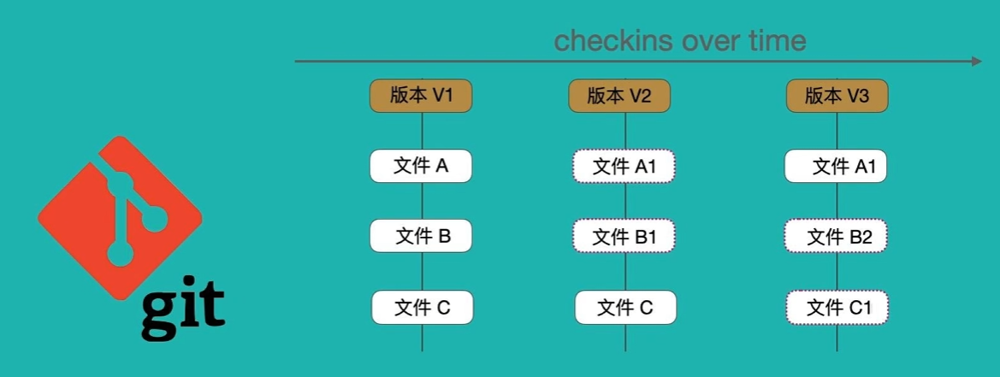
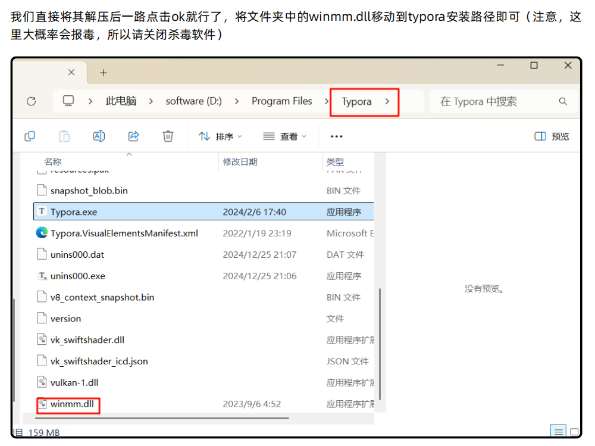
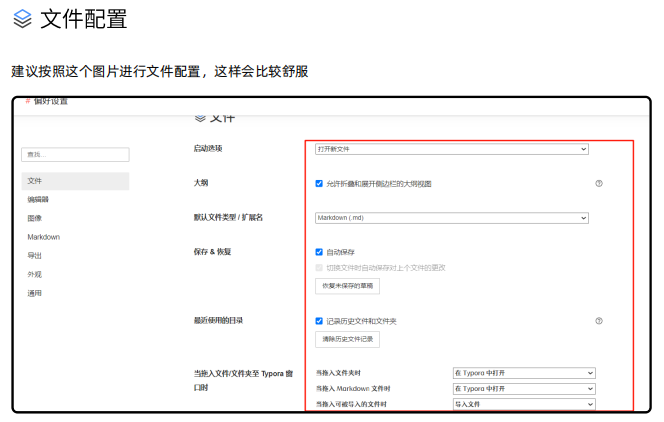
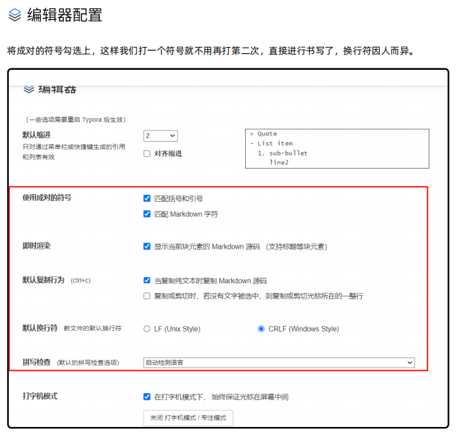
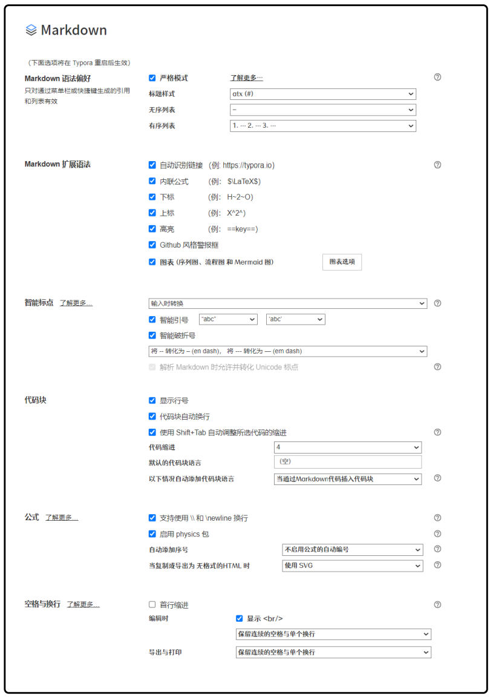
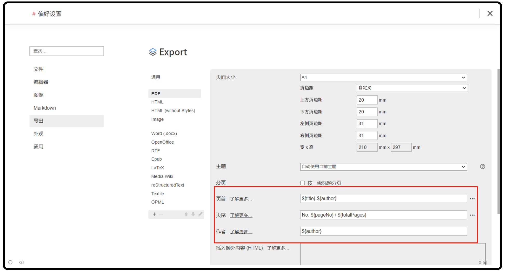
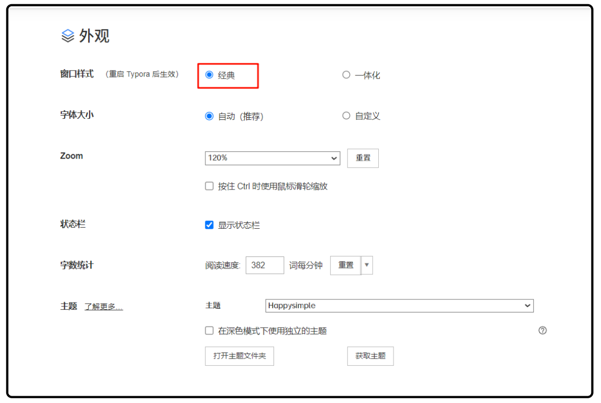
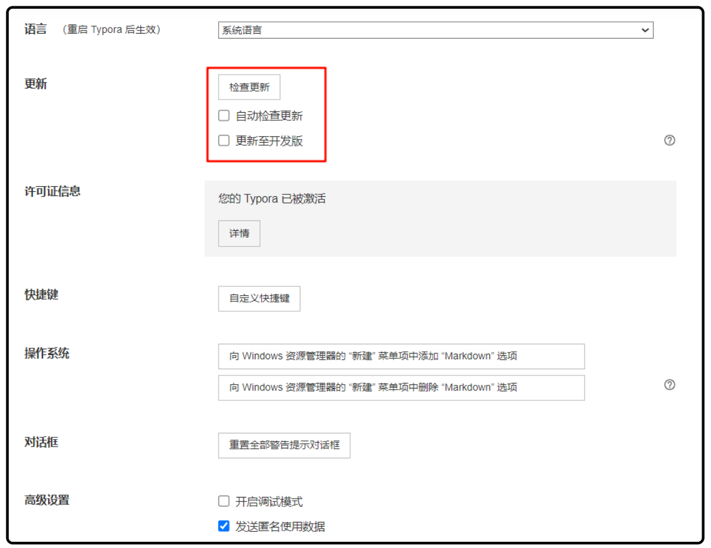

# Git & GitHub & Markdown & 插件

## **环境准备**

### Chrome 浏览器下载

**推荐使用国内 Cent Browser：**

- [官方下载地址(官网)](https://www.centbrowser.cn/)

- 继承谷歌内核稳定流畅的优点同时，与 Chrome 基本操作界面别无二致, 并加入其他常用功能

**推荐使用谷歌 Chrome 浏览器：**

- [官方下载地址（需科学上网）](https://www.google.com/chrome/)
- 或搜索“Chrome 浏览器下载国内镜像”获取国内最新可用链接。

## **网络技术与国际通信**

在跨境电商和国际贸易中，稳定的网络连接至关重要。同样，对于学习 GitHub 等国际化开发工具，良好的网络环境也能显著提升效率。

### GitHub 学习加速工具

为了更高效地学习和使用 GitHub，可以借助以下工具优化访问体验：
> **声明**：本文内容仅供技术学习与交流，严禁用于任何违法用途。
1. **GitHub 加速器**：
   - Watt Toolkit（steam++），FastGithub。
   - watt toolkit微软商店即可下载。

2. **国内镜像源**：
   - 使用国内镜像源下载，提升下载速度。
   - 示例：
   - [清华大学开源镜像站](https://mirrors.tuna.tsinghua.edu.cn/)
   - [阿里云开源镜像站](https://developer.aliyun.com/mirror/)

1. **文件代理加速**
   - 使用文件代理加速网站下载 GitHub 项目，提升下载速度。
   - 示例：https://github.akams.cn/

> **提示**：选择加速工具时，官方渠道，确保安全性和稳定性。

---


### VPN 与机场

#### VPN 是什么？机场是什么？

#### 名词解释

- **规则**：
- **全局**：
- **直连**：
- **中转**：
- **隧道**：
- **专线（IEPL/IPLC）**：
- **BGP**：
- **前置**：
- **转发**：
- **系统代理**：
- **TUN 模式/虚拟网卡**：

#### 线路体验优先级

同样带宽下，体验优先级：  

**IEPL 专线中转  隧道中转   公网中转   直连**


#### 推荐客户端工具

- **Windows/Mac/Android**：
- **iOS**：

#### 客户端使用流程简述

****

## Git 与 GitHub

### GitHub 入门详解

#### 1. GitHub 是什么？

- **GitHub** 是全球最大的开源代码托管平台，基于 Git 版本控制，方便开发者协作、分享和展示项目。
- 在 GitHub 上，你可以：
  - 托管自己的项目代码，并进行版本管理
  - 查找和参与全球开源项目
  - 与他人协作开发（团队项目、开源贡献）
  - 展示个人作品，提升技术影响力

#### 2. GitHub 账号注册与界面介绍

- [GitHub 注册入口](https://github.com/)

- 不建议直接使用教育邮箱注册

  > 我们学校的教育邮箱是   学号@stu.nchu.edu.cn
  >
  > 教育认证可额外绑定教育邮箱，可获取学生认证福利（如 Copilot 免费使用）

- 注册流程：填写邮箱、用户名、密码 → 邮箱验证 → 完善个人资料

##### GitHub 主要界面说明

- **Repositories（仓库）**：项目代码的存放地，每个仓库包含代码、文档、历史记录等
- **Issues**：用于提交问题、建议、任务分解，方便项目管理和交流
- **Pull Requests（PR）**：代码协作的核心，提交代码修改请求，项目维护者审核后合并
- **Fork**：复制别人的项目到你的账户，方便独立开发或贡献代码
- **Star**：收藏项目，方便日后查找
- **Actions**：自动化 CI/CD 工具，帮助自动测试和部署

#### 3. GitHub 教育认证与 Copilot 白嫖流程

- **GitHub Copilot**：AI 智能编程助手，自动补全代码、生成函数/注释，提升开发效率

- **教育认证步骤**：

  1. 注册并登录 GitHub 账号

  2. 访问 [GitHub Education](https://education.github.com/) 页面，点击“Get benefits”或“Apply for Student Developer Pack”

  3. 根据提示填写教育邮箱、学生身份等信息，提交认证

     > 1.直连
     >
     > 2.中英文双份教育证明 学生证 学信网…

  4. 通过后可免费开通 Copilot（[Copilot 激活入口](https://github.com/settings/copilot)）

#### 4. GitHub 基础实战流程

- **远程仓库协作流程**：
  1. Fork 项目到个人账户
  2. Clone 仓库到本地
  3. 新建分支，进行开发
  4. 提交并推送修改到远程分支
  5. 发起 Pull Request，等待项目维护者审核合并
  6. 参与 Issues 讨论，跟进项目进展

- **常见协作场景**：
  - 团队开发：多人协作同一项目，分工明确，分支合并
  - 开源贡献：发现项目问题或有新功能建议，可提交 PR 或 Issue
  - 个人作品：将自己的代码托管公开

#### 5. GitHub 常用术语补充

- **Commit**：每一次代码提交
- **Branch**：分支，独立开发环境
- **Merge**：合并分支
- **Release**：项目发布版本
- **Webhook**：自动消息通知

---

### Gitee 入门详解

#### 1. Gitee 是什么？

- **Gitee（码云）**：中国主流的代码托管平台，支持 Git 管理，适合国内团队、企业使用。
- 优势：
  - 国内访问速度快，无需科学上网
  - 支持私有仓库免费（适合团队或企业项目）
  - 与中国开发者生态结合紧密（对接企事业单位、开源中国等）

#### 2. Gitee 账号注册与界面介绍

- [Gitee 注册入口](https://gitee.com/)
- 支持手机号、邮箱注册
- 注册流程：填写信息 → 验证 → 完善个人资料

##### Gitee 主要界面说明

- **项目（Project）**：代码仓库
- **问题（Issue）**：项目问题追踪与任务管理
- **合并请求（Pull Request）**：代码协作
- **收藏、Fork、Watch**：功能与 GitHub 类似

#### 3. Gitee SSH Key 配置与项目协作

- SSH Key 配置流程与 GitHub 类似（见上方）
- 项目协作流程：
  1. 创建或 Fork 仓库
  2. Clone 到本地
  3. 新建分支开发，提交并推送
  4. 发起合并请求
  5. 参与 Issue 讨论

#### 4. Gitee 特色功能

- 支持企业版和团队协作
- 支持中国主流第三方登录（微信、支付宝等）
- 支持私有仓库免费，适合企业内部项目管理

---

#### 第五部分：GitHub 和 Gitee 的核心功能对比

| 功能         | GitHub              | Gitee                |
| ------------ | ------------------- | -------------------- |
| Fork         | 复制项目到个人账户  | 同样支持复制项目     |
| Star         | 收藏项目            | 同样支持收藏项目     |
| Watch        | 订阅项目动态        | 支持订阅             |
| Issues       | 提交问题或建议      | 问题追踪支持更本地化 |
| Pull Request | 提交代码修改和合并  | 类似功能             |
| Actions      | 自动化 CI/CD 工作流 | 不支持 Actions       |
| Pages        | 静态网站托管        | 提供类似功能         |
| Releases     | 发布稳定版本        | 同样支持发布功能     |
| Webhooks     | 自动消息通知        | 支持类似功能         |

****

### Git 是什么

**Git 就像一本“时光机日记本”📖**  

每段代码的改动，Git 都会帮你记录下来，随时可以“穿越回过去”查找任何时间点的代码状态。

- **主要特点：**
  1. **版本控制**：每次提交都像写新日记，保存开发成果。
  2. **分支管理**：分支如同章节，可以并行开发互不干扰。
  3. **分布式**：每个人都有完整的“时光机日记本”，即使没有网络也能工作。




> feature分支（添加功能命名）
>
> hotfix分支（修bug）
>
> release分支（预发布）

---

### Git 与 GitHub SSH Key 配置与使用

#### 1. 配置个人信息

```bash
git config --global user.name "你的名字"
git config --global user.email "你的邮箱"
```
- 设置后每次提交都会自动带上你的署名。

#### 2. 生成 SSH 密钥

```bash
ssh-keygen -t rsa -b 4096 -C "你的邮箱@example.com"
```
- -t rsa ：使 ⽤ RSA 算法 ⽣ 成密钥。
- 一路回车即可，密钥默认保存在 `~/.ssh/` 目录。

#### 3. 查看并复制公钥内容

```bash
cat ~/.ssh/id_rsa.pub
```
- 复制输出的内容（全部内容）。

#### 4. 添加公钥到远程仓给i他库

- **GitHub**：Settings > SSH and GPG keys > New SSH key，粘贴公钥并保存。
- **Gitee**：设置 > 安全设置 > SSH 密钥，粘贴公s钥并保存。

#### 5. 测试连接

- GitHub：`ssh -T git@github.com`
- Gitee：`ssh -T git@gitee.com`

- 第一次会提示“Are you sure you want to continue connecting”，输入 yes
- 若看到 `Hi 用户名! You've successfully authenticated...` 表示成功！

#### 6. 多平台/多账户密钥配置（进阶）

- 多台电脑、多个平台可分别生成密钥并添加到账户。
- 如需配置多个密钥，在 `~/.ssh/config` 文件中添加：

```
Host github.com
  HostName github.com
  User git
  IdentityFile ~/.ssh/id_rsa

Host gitee.com
  HostName gitee.com
  User git
  IdentityFile ~/.ssh/id_rsa_gitee
```

### Git 命令

#### 基本操作

```bash
# 初始化仓库（只需一次）
git init

# 克隆远程仓库到本地
git clone <仓库地址>

# 查看当前状态
git status

# 查看历史提交记录
git log
```

#### 文件操作

```bash
# 添加所有更改到暂存区
git add .

# 添加指定文件到暂存区
git add 文件名

# 从暂存区移除文件
git reset 文件名
```

#### 提交/保存更改

```bash
# 提交到本地仓库
git commit -m "提交说明"
```

#### 与远程仓库交互

```bash
# 关联远程仓库（只需一次）
git remote add origin <仓库地址>

# 推送到远程仓库
git push

# 推送到远程指定分支（第一次推送用）
git push -u origin main

# 从远程仓库拉取最新内容
git pull
```

#### 分支管理

```bash
# 查看所有分支
git branch

# 创建新分支
git branch 新分支名

# 切换分支
git checkout 分支名

# 创建并切换到新分支
git checkout -b 新分支名

# 删除本地分支
git branch -d 分支名

# 查看远程分支
git branch -r

# 拉取远程分支并创建本地分支
git checkout -b 本地分支名 origin/远程分支名

# 删除远程分支
git push origin --delete 分支名
```

#### 撤销与恢复

```bash
# 撤销工作区的修改（让文件恢复到上一次commit的状态）
git checkout -- 文件名

# 撤销暂存区的修改（把已add的文件撤回到工作区）
git reset HEAD 文件名

# 撤销最近一次commit但保留修改（回退到上一次commit，修改内容还在）
git reset --soft HEAD^

# 丢弃最近一次commit和修改（慎用，修改会丢失）
git reset --hard HEAD^

# 恢复被删除的文件（找回误删的文件）
git checkout HEAD -- 文件名
```

#### 查看与对比

```bash
# 查看本地和远程分支对应关系
git branch -vv

# 查看远程地址
git remote -v

# 查看某个文件的修改内容
git diff 文件名

# 查看暂存区和上一次commit的区别
git diff --cached

# 查看某个文件的历史修改记录
git log 文件名

# 对比本地分支与远程分支的差异
git diff main origin/main
```

#### 标签（Tag）

```bash
# 打标签
git tag v1.0

# 推送标签到远程
git push origin v1.0

# 查看所有标签
git tag
```

#### 合并与冲突

```bash
# 合并分支
git merge 另一个分支名

# 解决冲突后，添加并提交
git add .
git commit -m "fix conflict"
```

---

> **提示：**
>
> - 不会的命令可以用 `git help 命令名` 查看帮助。
> - 日常开发建议多用 `git status` 和 `git log` 观察当前状态。
> - 日常开发推荐分支模型，每个功能新建分支，开发完成合并主线

---

### Git 常用命令速查表

| 功能             | 命令                                                         | 说明                                 |
| ---------------- | ------------------------------------------------------------ | ------------------------------------ |
| 配置用户名和邮箱 | `git config --global user.name "你的名字"` <br> `git config --global user.email "你的邮箱"` | 设置“署名”，每次提交都标记贡献者     |
| 初始化仓库       | `git init`                                                   | 新建“时光机日记本”，准备记录代码版本 |
| 添加文件到暂存区 | `git add 文件名` 或 `git add .`                              | 把修改内容放到“草稿区”               |
| 提交到本地仓库   | `git commit -m "提交说明"`                                   | 草稿正式进入日记本，并附说明         |
| 推送到远程仓库   | `git push origin 分支名`                                     | 把本地代码同步到远程仓库             |
| 克隆远程仓库     | `git clone 仓库地址`                                         | 下载别人的代码到本地                 |
| 查看状态         | `git status`                                                 | 检查当前代码变化情况                 |
| 查看提交历史     | `git log`                                                    | 查看代码记录，回顾“时间线”           |
| 创建分支         | `git branch 分支名`                                          | 新功能独立章节                       |
| 切换分支         | `git checkout 分支名`                                        | 从一个章节切换到另一个章节           |
| 合并分支         | `git merge 分支名`                                           | 不同章节内容合并到主线               |
| 拉取远程代码     | `git pull origin 分支名`                                     | 从远程仓库获取最新代码               |

****

### 总结

- **Git**：本地代码管理和版本控制工具
- **GitHub**：全球开源协作、作品展示和技术交流平台
- **Gitee**：国内主流代码托管平台，适合本地团队和企业项目协作

**建议：**

- 日常学习和开源项目优先用 GitHub，参与国际技术社区
- 团队/企业项目可选用 Gitee，便于国内协作和访问
- 熟练掌握 Git 命令和 SSH 配置，提升协作效率

****

## Typora 与 Markdown

### Typora 使用教程

#### 安装和激活

- 下载 Typora 安装包，运行后一路点击 OK 即可完成安装。
- 如果需要激活，将文件夹中的 **winmm.dll** 移动到 Typora 的安装路径下（如 D:\Program Files\Typora）。注意此步骤需关闭 Typora 软件，否则会报错。



---

#### 插件使用

- 推荐安装 [typora_plugin](https://github.com/obgnail/typora_plugin)：可以显著优化 Typora 的使用体验，按官方文档安装即可。
- 论文工具[typora-latex-theme](https://github.com/Keldos-Li/typora-latex-theme)：对于没有学过office三件套或WPS的同学大有帮助。

---

#### 建议配置

##### 侧边栏设置

- 建议将侧边栏打开，便于查看和管理文档结构。
- 在 Typora 主界面点击右下角的 `显示/隐藏侧边栏` 按钮即可。


---

##### 文件配置

- 进入 Typora 菜单栏 `文件 -> 偏好设置`，进行文件相关配置。
- 推荐按照下图设置，便于文档管理与文件归档。



---

##### 编辑器配置

- 推荐启用智能缩进、自动补全 Markdown 字符、统一行尾符号等功能，提升编辑效率，减少语法出错。



---

##### 图片配置

- 插入图片时，建议选择自动复制图片到当前 md 文件同名的 assets 文件夹下，方便文档迁移和分享。  
- 推荐勾选：  
  - 自动上传图片到 assets 文件夹
  - 优化图片路径显示
  - 生成图片相对路径  
- 图片插入后，建议压缩图片或生成缩略图，减少文档体积。

---

##### Markdown 配置

我们在这里可以配置markdown的语法相关，我的建议是全部勾上，一定勾选上那个图表，这样可以让typora对mermaid等图表代码直接进行渲染，下面的公式编号还是看个人情况，这里就不过多说了

- 建议开启 Typora 对 mermaid 图表和数学公式的支持，方便画流程图和写公式。
- 推荐设置常用语法快捷键，提升编辑效率。



---

#####  导出配置

- 可根据个人需求设置 PDF 导出参数，包括页面大小、边距等。
- 支持设置 YAML 头信息（如 title、author），导出时自动识别并加到对应位置。



---

##### 外观配置

- 推荐使用「经典」模式，字体大小和主题可按个人习惯调整，支持多种主题切换（如 HappySimple、Jetbrains Mono Theme 等）。



- 主题获取途径：
  - [Themes Gallery – Typora](https://theme.typora.io/)
  - GitHub 搜索 typora theme

---

##### 通用配置



- 建议关闭自动检查更新和开发版更新，稳定性更好。
- 可自定义快捷键，提升操作效率。

---

#### 主题美化

- 推荐主题：
  - **Neil Jetbrains Mono Theme**：适合 Jetbrains 系 IDE 用户，字体美观，界面简洁。
  - **HappySimple**：视觉舒适，适合日常写作和学习。

---

### Markdown 使用教程

#### 一、什么是 Markdown？

Markdown 是一种轻量级的标记语言，设计用于让普通文本具有丰富的格式表现，同时保留文案内容的易读性和易写性。通过简单直观的标记符号实现文档格式化，广泛应用于技术文档、博客文章、电子邮件、笔记和协作文档等。

---

#### 二、为什么选择 Markdown？

1. **简单直观**：语法易学易用，常见标记符号即可快速上手。
2. **跨平台支持**：兼容多种工具和平台，如 GitHub、Notion、VS Code、Jupyter Notebook 等。
3. **多格式输出**：可转为 HTML、PDF、Word 等多种格式，满足不同需求。
4. **专注创作**：无需复杂排版工具，专注内容本身，提升写作效率。

---

#### 三、Markdown 语法详解

##### 1. 标题

使用 `#` 符号表示标题，支持六级标题，`#` 的数量代表标题级别。

```markdown
# 一级标题
## 二级标题
### 三级标题
#### 四级标题
##### 五级标题
###### 六级标题
```
---

##### 2. 段落与换行

普通文本直接书写即可。若需换行，在行尾添加两个空格。

```markdown
这是一段文字，行尾加两个空格后换行。  
这是下一行。
```
---

##### 3. 强调

支持斜体和加粗，以及两者组合。

```markdown
*斜体* 或 _斜体_
**加粗** 或 __加粗__
***斜体加粗*** 或 ___斜体加粗___
```

效果：
- *斜体*
- **加粗**
- ***斜体加粗***

---

##### 4. 列表

支持无序列表和有序列表。

###### 无序列表

使用 `-`、`*` 或 `+` 作为标记符。

```markdown
- 项目一
- 项目二
  - 子项目一
  - 子项目三
* 项目三
```

效果：
- 项目一
- 项目二
  - 子项目一
  - 子项目三
- 项目三

###### 有序列表

使用数字加点 `1.`，数字顺序可不连续，最终会按顺序渲染。

```markdown
1. 项目一
2. 项目二
   1. 子项目一
   2. 子项目二
```

效果：
1. 项目一
2. 项目二
   1. 子项目一
   2. 子项目二

---

##### 5. 链接

添加超链接：

```markdown
[链接文字](链接地址)
[google](https://www.google.com)
```

带标题提示：

```markdown
[链接文字](链接地址 "标题提示")
[google](https://www.google.com "谷歌搜索")
```

效果如下：
[Google](https://www.google.com)
[Google](https://www.google.com "谷歌搜索")

---

##### 6. 图片

添加图片与链接类似，只需在前面加一个 `!`。

```markdown


```

---

##### 7. 引用

引用使用 `>` 进行标记，支持嵌套引用。

```markdown
> 这是一个引用。
>> 这是嵌套引用。
```

效果：
> 这是一个引用。
> > 这是嵌套引用。

---

##### 8. 代码块

###### 行内代码

用反引号（`）包裹。

```markdown
`这是行内代码` 示例。
```

效果：`这是行内代码` 示例。

###### 多行代码块

用三个反引号（```）包裹，可指定语言高亮。

```markdown
``` python
def hello():
    print("Hello, Markdown!")
```
```

效果如下：

```python
def hello():
    print("Hello, Markdown!")
```

---

##### 9. 表格

使用 `|` 和 `-` 创建表格。

```markdown
| 表头1 | 表头2 | 表头3 |
|-------|-------|-------|
| 数据1 | 数据2 | 数据3 |
| 数据4 | 数据5 | 数据6 |
```

效果：
| 表头 1 | 表头 2 | 表头 3 |
| ----- | ----- | ----- |
| 数据 1 | 数据 2 | 数据 3 |
| 数据 4 | 数据 5 | 数据 6 |

---

##### 10. 分隔线

用三个或更多的 `-`、`*` 或 `_` 创建分隔线。

```markdown
---
***
___
```

#### 效果如下：

****

#### 任务列表

用 `- [ ]` 创建未完成任务，`- [x]` 创建已完成任务。

```markdown
- [ ] 任务一
- [x] 任务二
- [ ] 任务三
```

效果：
- [ ] 任务一
- [x] 任务二
- [ ] 任务三

---

##### 12. 公式

支持 LaTeX 数学公式（部分编辑器/平台需开启支持）。

```markdown
$\frac{a}{b}$
```

效果：$\frac{a}{b}$

---

### Typora 快捷键速查表

| 功能            | 快捷键（Windows）   | 快捷键（Mac）     | 说明                           |
| --------------- | ------------------- | ----------------- | ------------------------------ |
| 加粗            | Ctrl + B            | Cmd + B           | 选中内容加粗                   |
| 斜体            | Ctrl + I            | Cmd + I           | 选中内容斜体                   |
| 插入标题        | Ctrl + 1 ~ Ctrl + 6 | Cmd + 1 ~ Cmd + 6 | 对应一级至六级标题             |
| 插入无序列表    | Ctrl + Shift + U    | Cmd + Shift + U   | 快速插入无序列表               |
| 插入有序列表    | Ctrl + Shift + O    | Cmd + Shift + O   | 快速插入有序列表               |
| 插入任务列表    | Ctrl + Shift + C    | Cmd + Shift + C   | 插入 `- [ ]` 任务项            |
| 插入代码块      | Ctrl + Shift + K    | Cmd + Option + K  | 插入三反引号代码块（块级代码） |
| 插入行内代码    | Ctrl + E            | Cmd + E           | 插入行内代码（单反引号）       |
| 插入图片        | Ctrl + Shift + I    | Cmd + Shift + I   | 打开插入图片对话框             |
| 插入链接        | Ctrl + K            | Cmd + K           | 插入超链接                     |
| 插入引用        | Ctrl + Shift + Q    | Cmd + Shift + Q   | 插入引用 >                     |
| 插入表格        | Ctrl + T            | Cmd + T           | 打开插入表格面板               |
| 插入公式        | Ctrl + Shift + M    | Cmd + Shift + M   | 插入公式块（$$）               |
| 插入Mermaid图   | Ctrl + Shift + G    | Cmd + Shift + G   | 插入mermaid绘图代码块          |
| 切换专注模式    | F8                  | F8                | 切换专注模式（Focus Mode）     |
| 打开/关闭侧边栏 | Ctrl + /            | Cmd + /           | 显示或隐藏左侧目录栏           |
| 查找            | Ctrl + F            | Cmd + F           | 查找文本                       |
| 替换            | Ctrl + H            | Cmd + Option + F  | 查找并替换文本                 |
| 保存            | Ctrl + S            | Cmd + S           | 保存文档                       |
| 导出            | Ctrl + Shift + E    | Cmd + Shift + E   | 导出为PDF、HTML等格式          |
| 打开偏好设置    | Ctrl + ,            | Cmd + ,           | 打开Typora设置                 |
| 新建文档        | Ctrl + N            | Cmd + N           | 新建一个空白文档               |
| 打开文档        | Ctrl + O            | Cmd + O           | 打开本地文档                   |
| 关闭文档        | Ctrl + W            | Cmd + W           | 关闭当前标签页                 |

> **提示：**  
> Typora 支持自定义快捷键，部分功能可在 “偏好设置” > “快捷键”中自定义。  
> 常用操作如插入代码块、插入图片、切换侧边栏等快捷键建议多加练习，提升效率。


---

## 插件与脚本

### 浏览器插件简介

> 脚本仅供学习交流，勿用于违规用途。

#### 1. 什么是浏览器插件？

浏览器插件（扩展）是一种可以为浏览器增加新功能的小型程序。它们能够帮助用户实现自动化、界面美化、广告屏蔽、脚本自定义等功能，极大提升日常上网体验和效率。

---

#### 2. 油猴（Tampermonkey）与篡改猴（Violentmonkey）简介与对比

**油猴（Tampermonkey）** 和 **篡改猴（Violentmonkey）** 都是浏览器端最主流的用户脚本管理器插件，能够让用户轻松安装、管理和运行自定义脚本（如刷课、自动答题、网页优化等）。

|          | 油猴（Tampermonkey）        | 篡改猴（Violentmonkey）    |
| -------- | --------------------------- | -------------------------- |
| 兼容性   | Chrome/Edge/Firefox/Safari  | Chrome/Edge/Firefox/Opera  |
| 界面     | 功能丰富，设置选项更多      | 界面简洁，轻量，易用       |
| 脚本支持 | 支持几乎所有主流用户脚本    | 支持大部分脚本，兼容性优秀 |
| 开发者   | 国外团队                    | 国外团队（有国人参与）     |
| 推荐场景 | 需要高级管理/脚本较多的用户 | 追求简洁/轻量的用户        |

**小结：**
- 油猴（Tampermonkey）适合大多数用户，功能更全，兼容性最好，推荐新手优先选择。
- 篡改猴（Violentmonkey）更轻量，界面简洁，资源占用更低。

---

#### 3. 安装方法

**a. Chrome 浏览器：**
- 推荐前往 [crx搜搜插件网](https://www.crxsoso.com/search) 搜索「Tampermonkey」或「Violentmonkey」并下载安装（国内无需科学上网）。

  > 聚合了 Chrome、Edge、Firefox 各类插件和油猴脚本，国内访问速度快，适合查找各类扩展和脚本。

- 也可去 [Chrome Web Store](https://chrome.google.com/webstore/) 安装。

**b. Edge 浏览器：**
- 可在 Edge 插件商店或 crx搜搜 搜索并安装。

**c. Firefox 浏览器：**

- 前往 [Firefox 附加组件](https://addons.mozilla.org/) 搜索并安装。

---

### 脚本

####     简介

- **官网/项目主页**：[OCS](https://docs.ocsjs.com/)
- **主要功能**：

####      简介

- **官网主页**：[题库](https://tk.enncy.cn/)

#### 脚本与教程

- **EOC 一站式脚本合集**：[EOC](https://ssmjae.github.io/EOC/)

**使用建议：**

---

**实用建议：**

- 插件和脚本建议只从知名平台和官方渠道下载，避免安全风险。
- 使用脚本前请详细阅读说明，注意账号安全，不要泄露个人信息。

---


